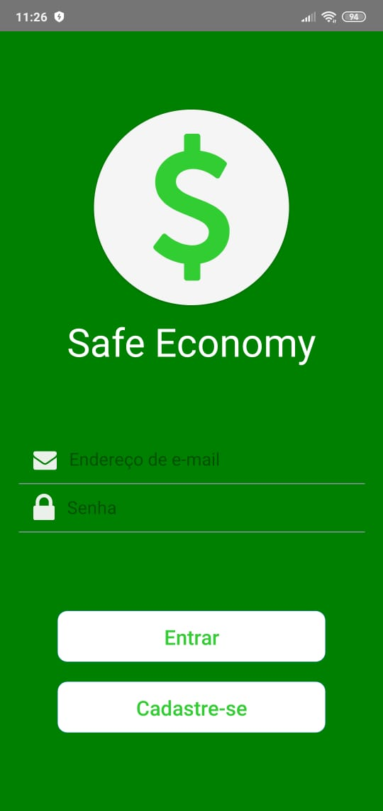

# Safe-Economy
Aplicativo em React Native para monitoramento de saldo de usuário e simulação de pagamento de contas criado para a disciplina de Engenharia de Software

Para reproduzir bastar clonar o projeto e dar o comando npm install ou yarn no prompt de comando

